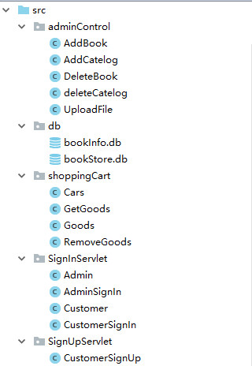
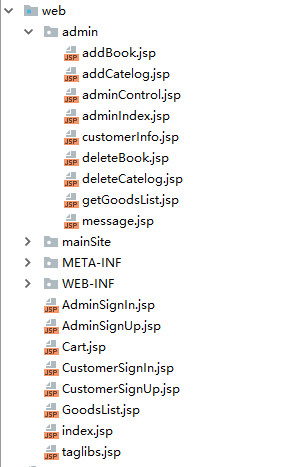
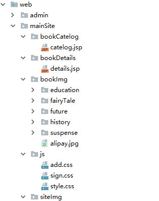
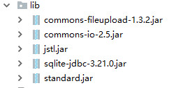
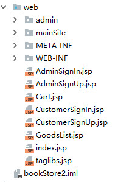

#bookStore介绍

这是一个 `jsp` +`servlet` + `sqlite` 完成的基本功能完善的书店。

其中包括 `客户端` `管理端`

	客户端主要功能
		1.用户登录
		2.查看书籍
		3.添加购物车
		4.提交订单

	
------

	管理端主要功能
		1.管理员登录
		2.对书籍的增删改查
		3.查看订单
		4.查看用户信息

在完成以上功能，基本上完成了整个书店的功能。

-----------------------------

以下是代码树

这是项目的src文件夹，主要存放各种java类。用于实现servlet，signInServlet代表登录用的servlet类，以此类推。其中db文件夹下面是所用到的sqlite数据库。

-----------------------

这是项目的web-admin文件夹，主要是管理端的各种操作页面比如addBook.jsp是管理端加书籍的页面，以此类推。

-------------------------------

这是web-mainSite文件夹，包括整个站点所需要的js代码以及图片。bookImg代表书籍的图片

--------------------------

项目依赖包

----------------------

项目主页面，登录页面，注册页面等等

#注意

需要运行时将本库的war包考下来，放到tomcat的webapps目录下，去bin目录启动tomcat，在浏览器输入 localhost:8080/bookStore 即可运行。以上所有代码均可以在解压后的war包里面找到。

本代码采用 GPL协议，请悉知。
